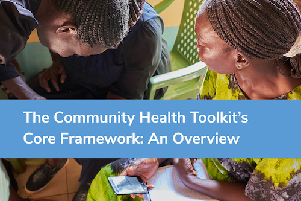
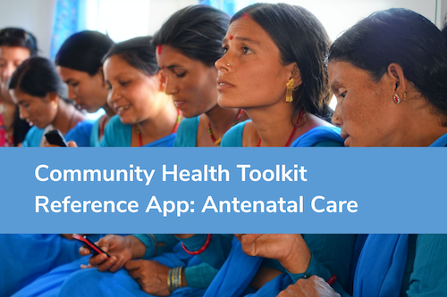
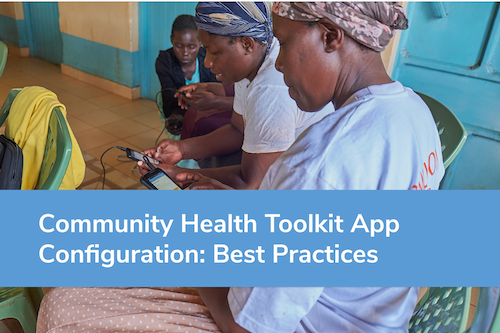
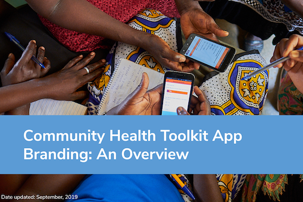

# Overview

The [Community Health Toolkit](http://communityhealthtoolkit.org) (CHT) is a project by a group of leading organizations who have come together to support the development of digital health initiatives in the hardest-to-reach areas.

The Community Health Toolkit provides you with resources to design, build, deploy, and monitor digital tools for community health. It includes open source software frameworks and reference applications highlighting common use cases, guides to help design and use them, and a [community forum](https://forum.communityhealthtoolkit.org) for collaboration and support. Together, we can work toward a world where healthcare is of the highest attainable quality, equitable, accessible, and delivered by the people who are trusted most in their communities.

# Table of Contents

* This will become a table of contents (this text will be scraped).
{:toc}

# Featured Resources

## The Community Health Toolkit Icon Library

This collection of 60+ free icons was developed by the Medic Mobile team to represent key elements of different community health workflows and protocols. These icons can be used in your app or for other communication efforts. Click here to [access the icon library's repo](https://github.com/medic/icon-library).

## The Core Framework by Medic Mobile

The Core Framework makes it faster to build full-featured, scalable digital health apps by providing a foundation developers can build on. These apps can support most languages, are offline-first, and work on basic phones (via SMS), smartphones, tablets, and computers.

App developers are able to define health system roles, permissions and reporting hierarchies, and make use of five highly configurable areas of functionality: messaging, task and schedule management, decision support workflows, longitudinal person profiles, and analytics.

The Core Framework can be used to support the unique needs of a given health system and the work of community health workers, frontline supervisors, facility-based nurses, health system managers, and even patients and caregivers. Visit the Commuity Health Toolkit website to request a [self-guided demo](https://communityhealthtoolkit.org/contact) of an app built with the Core Framework. You can also explore an [overview of the Core Framework](./resource-overviews/core-framework-overview.pdf) and its key features.

## Antenatal Care Reference App by Medic Mobile

Our tools are configurable by design, support an exceptional range of features and health service areas. Our ANC Reference App provides organizations with a template for structuring and organizing you app, it’s configuration code, and testing framework. It includes a foundation for forms related to pregnancy and delivery, flexible data fields, and even analytics, and can be deployed as-is or customized by a developer for your unique context. To install the ANC Reference Application, follow our [easy installation instructions](https://github.com/medic/cht-core/blob/master/INSTALL.md). An [overview of the ANC Reference App](./resource-overviews/anc-reference-app-overview.pdf) and its key features is also available.

If you want to modify our ANC Reference Application for your project or context, read our [configuration best practices](https://github.com/medic/medic.github.io/blob/master/resource-overviews/configuration-best-practices-overview.pdf) or learn how to [develop your own community health apps](https://github.com/medic/medic-docs/blob/master/configuration/developing-community-health-applications.md).

## OppiaMobile by Digital Campus

OppiaMobile is an open source mobile learning platform specially designed  for delivering learning content, multimedia and quizzes in low-broadband settings. All the content and activities can be accessed and used even when no internet connection is available, and users can earn points and badges for completing activities, quizzes and watching videos. Visit Digital Campus's [website](https://digital-campus.org/oppiamobile/) to learn more about OppiaMobile's features. You can also read their platform [overview for developers](https://digital-campus.org/oppiamobile/developers/).

# Are You Interested In:

## Using Tools Built with the Community Health Toolkit

The resources provided through the Community Health Toolkit can be used to build digital health apps used at the community, health facility, and health system level:

**At the community level,** community health workers (CHWs) use apps built with the CHT to register patients, conduct guided health assessments, screen for specific conditions and danger signs, and refer patients to health facilities.

**At the health facility level,** nurses and CHW supervisors use apps and admin consoles built with the CHT to coordinate care for patients with the CHWs, promote health practices in the community, and report health and service delivery statistics to health system officials

**At the health system level,** data managers and others use apps and admin consoles built with the CHT to collate and report on key community and health system data. Their work often involves following up with supervisors and nurses to verify data for accuracy and completion.

Have questions? Want to learn alongside a community of users? Join our [community forum](https://forum.communityhealthtoolkit.org) and let us know how we can help!

## Customizing and Configuring Our ANC Reference App

While our ANC Reference App can be used as is, most organizations and projects will want to configure and customize the app's tasks, care cuides, reports and even branding. These changes are not made at the Core Framework code level, but often still require technical skills and experience. To explore how we use forms to build the Tasks, Care Guides, and Reports that take health workers through care protocols and provide decision support for interactions with patients, read our [Configuration Best Practices Guide](./resource-overviews/configuration-best-practices-overview.pdf).

To learn how to add your own logo, project name, and more to our Reference App, read our [App Branding Guide](https://github.com/medic/medic.github.io/blob/master/resource-overviews/app-branding-overview.pdf).

We are in the process of writing additional guides and clearer API documentation. For now, [Part One](./docs/application_development/guides/from_scratch) of our guide to building an application from scratch is available, with more soon to follow.

## Contributing Code or Developing on the Core Framework

If you're interested in contributing to the development of the Core Framework, take a look at the [Core Framework's Github repository](https://github.com/medic/cht-core), follow the [development environment setup instructions](https://github.com/medic/medic/blob/master/DEVELOPMENT.md) and take a look at the [contribution guide](https://github.com/medic/medic/blob/master/CONTRIBUTING.md).

